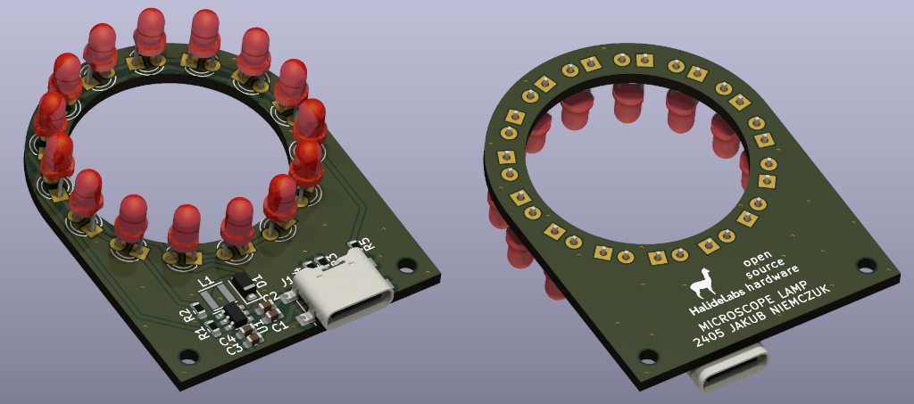
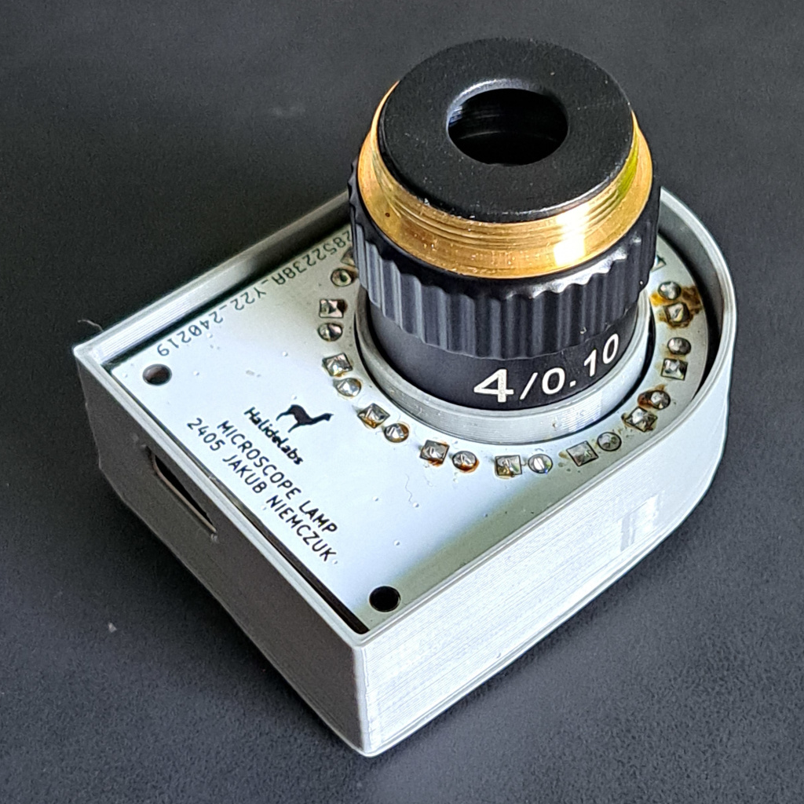

# Microscope Lamp
Lightning is key in photography. I started to do extreme electronics macrophotography using a 4X microscope objective: [(blog post)](https://niemczuk.tech/2024/02/11/detailed-macrophotography-of-PCBs), but the photographs had low contrast and shadows. So I created this little USB-C powered LED fixture that fits on top of the microscope objective and illuminates the scene.
All files (PCB, 3D housing, BOM) are in the repository files. Feel free to build your own.

 

 
Microscope Lamp by <a rel="cc:attributionURL dct:creator" property="cc:attributionName" href="https://niemczuk.tech">Jakub Niemczuk</a> is licensed under <a href="http://creativecommons.org/licenses/by-nc-sa/4.0/?ref=chooser-v1" target="_blank" rel="license noopener noreferrer" style="display:inline-block;">CC BY-NC-SA 4.0</a>
 